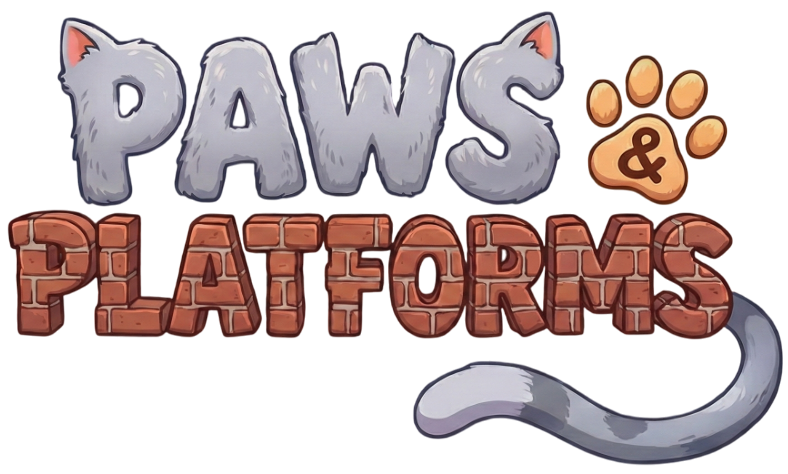
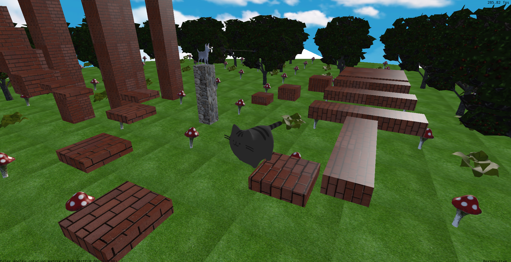
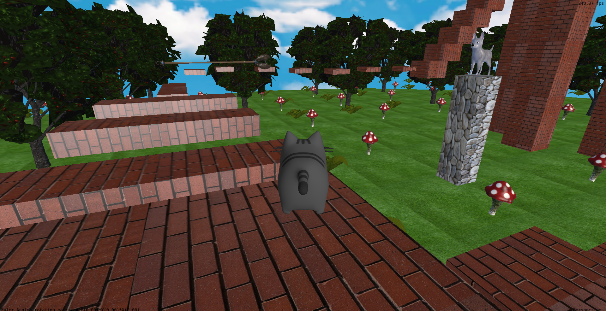

# PAWS & PLATFORMS - Trabalho Final de FCG


Este projeto consiste em uma aplicação gráfica desenvolvida como parte da avaliação da disciplina de Fundamentos de Computação Gráfica. Em PAWS & PLATFORMS você encontra uma aventura fascinante assumindo o controle do gatinho mais ágil da vizinhança! Seu objetivo é escalar as contruções de tijolo sem cair, além de fugir de obstáculos e coletar o rato Jerry no final para concluir o desafio! (DICA: cuidado com o cachorro arqueiro...)

## Imagens mostrando o funcionamento da aplicação
### Pulo pelo parkour:

### Cachorro atirando flecha (obstáculo):


## Manual do jogo

Você vai nascer no começo do parkour, mas pode explorar o lindo cenário antes de iniciar (não existe limite de tempo). Seguem as teclas para funcionamento do jogo:
* **W** -> anda para frente
* **S** -> anda para trás
* **A** -> anda para a esquerda
* **D** -> anda para a direita
* **ESPAÇO** -> pula
* **ENTER** -> altera a câmera (primeira ou terceira pessoa)
* **BOTÃO ESQ. DO MOUSE** -> controle da câmera e seu direcionamento
* **SCROLL DO MOUSE** -> zoom-in e zoom-out para controle da câmera

## Desenvolvimento e Conceitos Aplicados

### Processo
Desenvolvimento incremental e planejado, facilitado pela proximidade da dupla que pode se organizar em conversas presenciais e remotas para sincronizar as tarefas e discutir ideias. Primeiro, foi definido o projeto, e depois foi implementado o primeiro objeto móvel a partir das definições já feitas em um laboratório da disciplina, que ajudaram na construção. O processo seguiu com aprimoramento das câmeras, movimentação do objeto, curva de bezier, tipos de iluminação, cenário do parkour, colisões e outros fatos secundários (como população de cenário por exemplo).

### 1. Malhas Poligonais Complexas e Carregamento OBJ
Utilizamos a biblioteca tinyobjloader para carregar modelos complexos, compondo um cenário interessante com árvores, cogumelos, arbustos, estruturas retangulares, cachorro, flecha, rato e obviamente o gato.

### 2. Transformações Geométricas Controladas
O usuário controla o gato utilizando transformações de translação (movimento) e rotação (orientação do corpo ao virar) através do teclado. As matrizes de modelo (Model Matrix) são atualizadas em tempo real, tornando-o o jogo super interativo para o player

### 3. Câmeras Virtuais
Implementamos duas câmeras distintas:
* **Câmera Look-At (Padrão):** Uma câmera em terceira pessoa que segue o gato, focada sempre no personagem.
* **Câmera Primeira-Pessoa:** Simulamos estar nos "olhos" do gato.

### 4. Instância de Objetos
Para otimizar o cenário, utilizamos a mesma malha poligonal para desenhar múltiplos objetos, alterando apenas suas matrizes de modelo, algo replicado nas estruturas do parkour em alguns casos, além dos objetos que compõem o cenário.

### 5. Testes de Intersecção (`collisions.cpp`)
Todos os testes de colisão foram implementados no arquivo collisions.cpp, contendo:
* **Cubo-Cubo (AABB):** Utilizado para colisão entre o gato e as estruturas.
* **Cubo-Plano:** Utilizado para detectar o chão e evitar que o gato caia do mundo.
* **Segmento-Cubo:** Utilizado para a colisão entre a flecha atirada pelo cachorro e o gato.
* **Cubo-Esfera:** Utilizado para colisão entre o gato e o objetivo final do parkour, rato.

### 6. Modelos de Iluminação e Interpolação
Implementamos shaders que suportam diferentes modelos:
* **Modelos de Iluminação:** Objetos possuem componentes de iluminação **Difusa (Lambert)** (ex: Rato) e especular **Blinn-Phong** (ex: torre cachorro).
* **Interpolação de Gouraud:** (ex: Gato) onde a iluminação é calculada por vértice.
* **Interpolação de Phong:** (ex: Cogumelo) onde a iluminação é calculada por pixel.

### 7. Mapeamento de Texturas
Todos os objetos da cena possuem texturas carregadas de arquivos de imagem (PNG/JPG), garantindo mapeamento UV correto para evitar distorções, o que torna o nosso jogo bastante "agradável aos olhos".

### 8. Curvas de Bézier
A flecha atirada pelo cachorro na torre se comporta de acordo com uma curva de bezier cúbica, correspondendo a um obstáculo em movimento para o gato escapar


## Contribuição dos autores
* **Carolina Wajner**:
    - Implementação da Curva de Bezier para a flecha saindo do cachorro
    - Adição da maioria dos objetos do cenário, assim como suas texturas (árvores, cogumelos, cachorro, rato...) 
    - Implementação da criação automática de colisão para plataformas a partir de função
    - Implementação dos testes de colisão (Cubo-Cubo,Cubo-Esfera,Cubo-Segmento,Cubo-Plano)
    - Implementação da iluminação para objetos do cenário e rato Jerry
    - Correção das animações baseadas em tempo em sua versão final
    - Refatoração e aprimoramento do código, modularizando as funcionalidades, o que viabilizou o progresso ao longo do trabalho
  
* **Rodrigo Feldens**:
  - Criação estrutural do parkour
  - Implementação da lógica principal de troca de câmera e controle da mesma
  - Implementação da movimentação do player, incluindo o pulo com lógica de gravidade
  - Implementação de modelos de iluminação Difusa (Lambert) e Blinn-Phong para alguns dos obj
  - Implementação modelos de interpolação de Gouraud para o gato.
  - Adição de texturas dos objetos maiores do cenário

## Uso de Inteligência Artificial

A dupla fez uso de IA durante o desenvolvimento, especificamente o Google Gemini, para auxílios pontuais de entendimento e código.
A ferramenta foi utilizada principalmente para debug e explicação facilitada da documentação da biblioteca OpenGL por exemplo, assim como para a inserção de efeitos sonoros no jogo. Outro ponto importante foi para a construção do cenário, onde alguns cálculos de simetria e área auxiliados pela IA fez com que a repetição de árvores, cogumelos e arbustos fosse feita de uma forma automatizada (o parkour por exemplo foi 100% feito manualmente, plataforma a plataforma, o que deixa o resultado final mais belo mas consome muito tempo). A ferramenta mostrou-se bem útil para agilizar a escrita de código repetitivo e auxílio no entendimento da colisão, assim como para tirar dúvidas conceituais rápidas. No entanto, ela acabou atraplhando no momento em que os autores tinham uma dúvida pontual sobre algum debug e a IA generativa tinha alucinações e dava explicações muito complexas que fugiam do espoco da disciplina, sendo totalmente descartada nesses casos.

## Compilação e Execução da aplicação

### Pré-Requisitos
  * ter Git para clonar o repositório
  * compilador para a linguagem C++ (ex: g++)
  * CMake
  * Bibliotecas gráficas e afins já estão no código

### Passo a passo

* Clone o repositório:
    ```bash
    git clone https://github.com/rsfeldens/trabalho-final-fcg.git
    cd NetGuard
    ```

* Compile e rode de acordo com os comandos:
    ```bash
    mkdir build
    cd build
    cmake ..
    make
    make run
    ```

